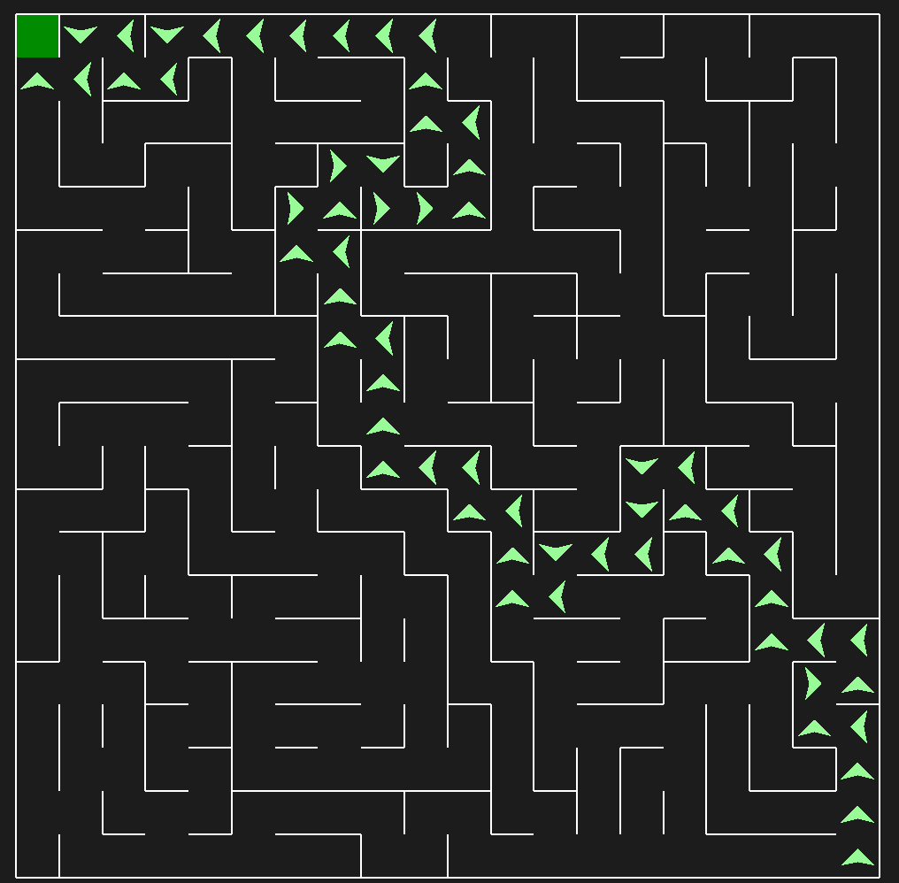

# A* Pathfinding – Unity & Python Implementations

This repository showcases two implementations of the **A\* (A-Star) pathfinding algorithm**, a widely used search algorithm for finding the shortest path between two points in a grid.

---

## 🔹 Part 1: A* Pathfinding in Unity

In the first part of the project, I used **Unity** and **C#** to create a visualization of the A* algorithm in action.

The algorithm calculates the **most efficient path** between a start and an end point, navigating around obstacles placed in the scene.

### Features:
- Visual representation of the search grid
- Start, goal, and obstacle placement
- Real-time pathfinding updates
- A* cost calculation using G, H, and F scores

### Screenshot:

  
*Optimal path found using A* in Unity*

---

## 🔹 Part 2: A* Maze Solver in Python

The second part recreates the algorithm in **Python**, this time to **solve randomly generated mazes** of any size. The goal was to apply A* in a different context, focusing on maze-solving efficiency and adaptability.

### Features:
- Random maze generation (customizable size)
- A* algorithm to find the shortest path
- ASCII or graphical output (depending on the version)
- Adjustable maze size (e.g., 10x10, 20x20, etc.)

### Screenshot:

  
*Path solved using A* in a randomly generated maze*

---

## 🛠️ Technologies Used

- **Unity + C#** (for visualization and interaction)
- **Python** (for maze generation and solving)
- `pymaze` *(Python library for visualization)*

---
